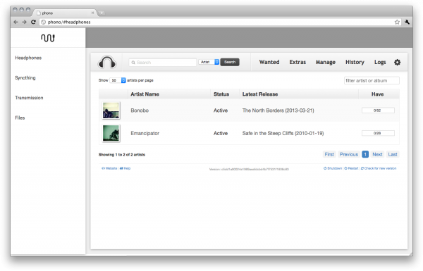

  

---

_Phono_ combines several 3rd-party tools to make it easier to download and transfer music to your devices.

As of now, it includes:

* [headphones](1) and [transmission](2) to retrieve music from torrents and usenet
* [syncthing](3) to synchronise music between your server and devices

  

## Usage

Start the container with `docker run`:

    docker run -p 80:80 -p 443:443 --name phono danhawkes/phono

Access the web UI at `https://<container ip>/`. The default username/password is `admin:admin`.

## Configuration

#### Volumes

`/phono/music` - The media library  

If you want to mount a directory or data volume in place of in-container storage, do so with the `--volume` argument:  

    docker run … -v '/home/whatever/music:/phono/music'

`/phono/appdata` - App configuration data.

App data is persisted in the container in between runs. If you'd like the container to be ephemeral, the configuration can be externalised by mounting it at `/phono/appdata`. The [default configuration](4) is in the repo.

`/etc/nginx/ssl` - SSL/TLS certs

By default, a new self-signed certificate is generated on startup. To replace it with your own, mount a directory containing `cert.pem` and `key.pem` at `/etc/nginx/ssl`.

#### Admin password

Set with the `--password` flag:

    docker run … --password hunter1

[1]: https://github.com/rembo10/headphones
[2]: http://www.transmissionbt.com/
[3]: https://syncthing.net/
[4]: https://github.com/danhawkes/phono/tree/master/appdata
